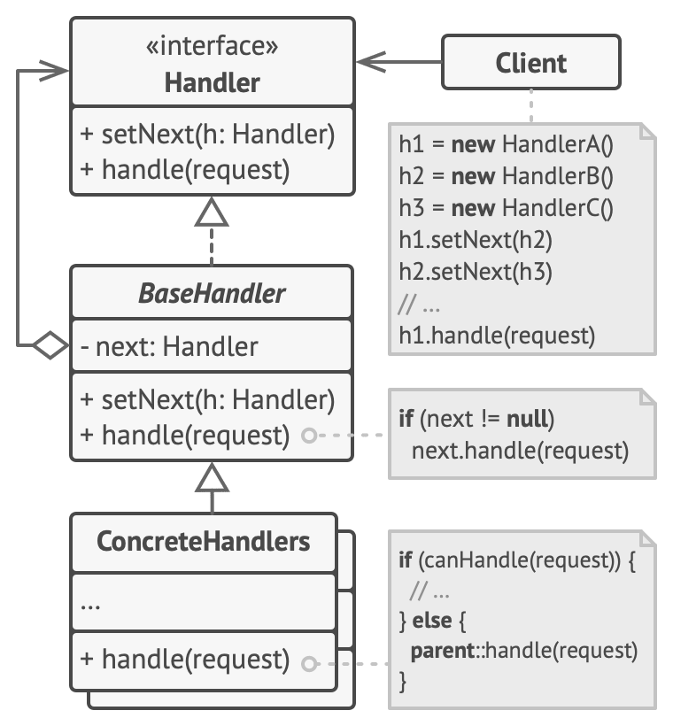

# Chain of Responsibility

Chain of Responsibility es un patrón de diseño de comportamiento que te permite pasar solicitudes a lo largo de una cadena de manejadores. Al recibir una solicitud, cada manejador decide si la procesa o si la pasa al siguiente manejador de la cadena.

## Estructura
1. La clase Manejadora declara la interfaz común a todos los manejadores concretos. Normalmente contiene un único método para manejar solicitudes, pero en ocasiones también puede contar con otro método para establecer el siguiente manejador de la cadena.
2. La clase Manejadora Base es opcional y es donde puedes colocar el código boilerplate (segmentos de código que suelen no alterarse) común para todas las clases manejadoras. Normalmente, esta clase define un campo para almacenar una referencia al siguiente manejador. Los clientes pueden crear una cadena pasando un manejador al constructor o modificador (setter) del manejador previo. La clase también puede implementar el comportamiento de gestión por defecto: puede pasar la ejecución al siguiente manejador después de comprobar su existencia.
3. Los Manejadores Concretos contienen el código para procesar las solicitudes. Al recibir una solicitud, cada manejador debe decidir si procesarla y, además, si la pasa a lo largo de la cadena. Habitualmente los manejadores son autónomos e inmutables, y aceptan toda la información necesaria únicamente a través del constructor.
4. El Cliente puede componer cadenas una sola vez o componerlas dinámicamente, dependiendo de la lógica de la aplicación. Observa que se puede enviar una solicitud a cualquier manejador de la cadena; no tiene por qué ser al primero.

### Fuente
https://refactoring.guru/es/design-patterns/chain-of-responsibility
